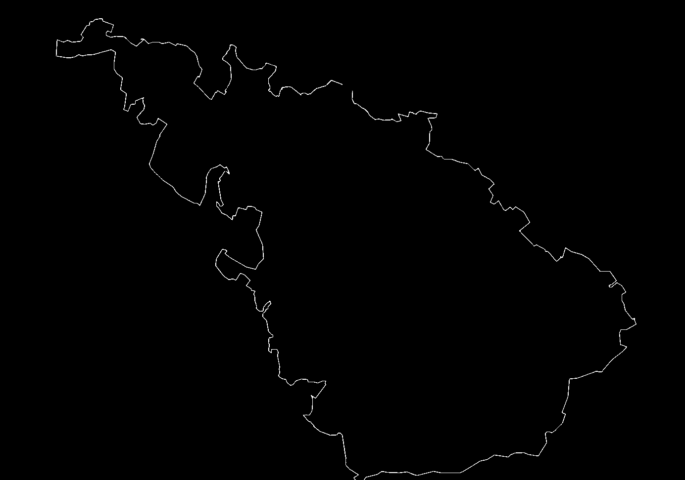
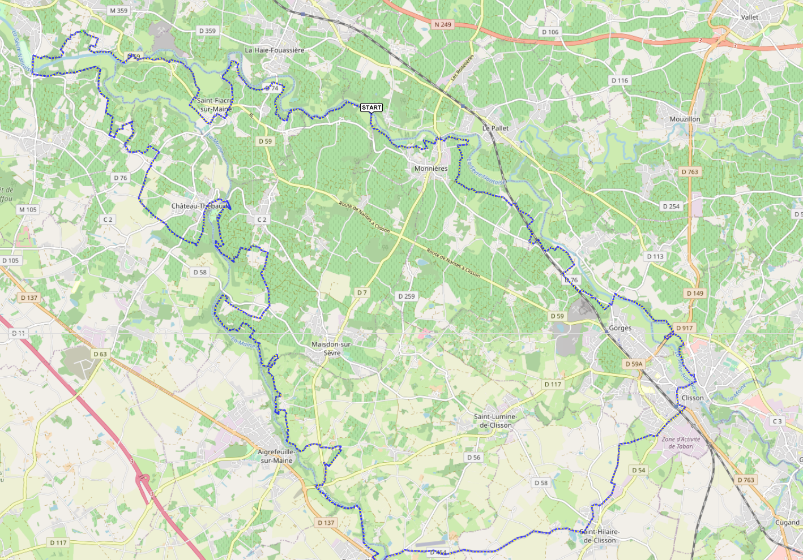

# picture-to-GPS
Extract GPS points from a route map picture with python/OpenCV

## How to run it
Work in progress: for the moment it works only with the example `visugpx.png`
```bash
python3 picture-to-GPS
```

## How it works
The goal is to get a GPX file from the PNG picture:


First, a mask of the route is create with OpenCV:



Then pixel points are selectionned on the route:



Finally, pixel points are converted to GPS coordinates and saved in a [GPX file](example/visugpx_output/visugpx.gpx).


